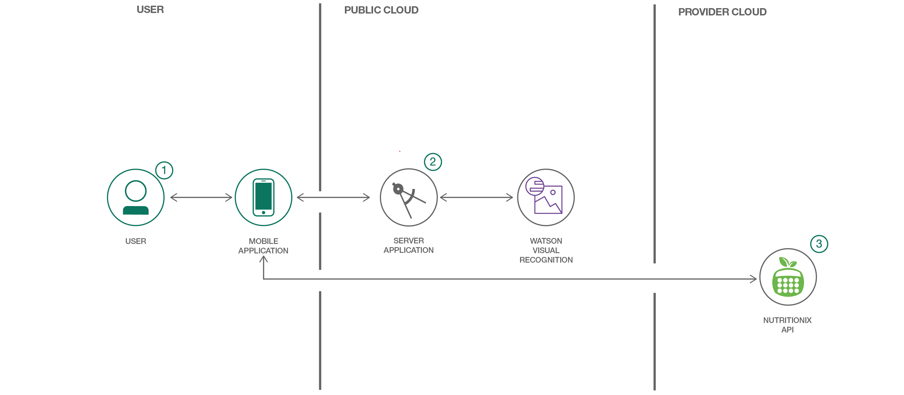
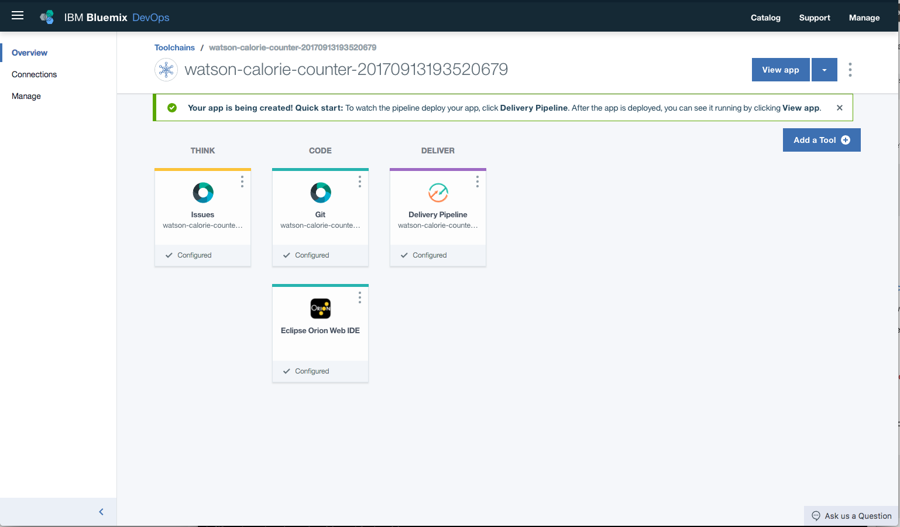

[](https://travis-ci.org/IBM/watson-calorie-counter)

# Create a calorie counter mobile app using Watson Visual Recognition

In this Code Pattern, we will create a calorie counter mobile app using Apache Cordova, Node.js and Watson Visual Recognition. This mobile app extracts nutritional information from captured images of food items.

Currently this mobile app only runs on Android, but can be easily ported to iOS.



## Flow

1. User interacts with the mobile app and captures an image.
2. The image is passed to the server application which uses Watson Visual Recognition Service to analyze the images and Nutritionix API to provide nutritional information.
3. Data is returned to the mobile app for display.

## Included components

* [Watson Visual Recognition](https://www.ibm.com/watson/developercloud/visual-recognition.html): Visual Recognition understands the contents of images - visual concepts tag the image, find human faces, approximate age and gender, and find similar images in a collection.

## Featured Technologies

* Mobile: Systems of engagement are increasingly using mobile technology as the platform for delivery.
* [Nutritionix API](https://developer.nutritionix.com/): The largest verified database of nutrition information.
* [Node.js](https://nodejs.org/): An asynchronous event driven JavaScript runtime, designed to build scalable applications.

# Watch the Video

[](https://youtu.be/Jp_9hKoNYrM)

# Steps

This Code Pattern contains several pieces. The app server communicates with the Watson Visual Recognition service. The mobile application is built locally and run on the Android phone.

## Deploy the Server Application to IBM Cloud

[](https://bluemix.net/deploy?repository=https://github.com/IBM/watson-calorie-counter)

1. Press the above ``Deploy to IBM Cloud`` button and then click on ``Deploy``.

2. In `Toolchains`, click on `Delivery Pipeline` to watch while the app is deployed.



3. To see the app and services created and configured for this Code Pattern, use the IBM Cloud dashboard. The app is named `watson-calorie-counter` with a unique suffix. The following services are created and easily identified by the `wcc-` prefix:
    * wcc-visual-recognition

> Note: Make note of the `watson-calorie-counter` URL route - it will be required for later use in the mobile app.

To complete the installation, perform the following steps:

1. [Clone the repo](#1-clone-the-repo)
2. [Obtain a Nutritionix API ID and key](#2-obtain-a-nutritionix-api-id-and-key)
3. [Update config values for the Mobile App](#3-update-config-values-for-the-mobile-app)
4. Perform either 4a or 4b.

    4a. [Install dependencies to build the mobile application](#4a-install-dependencies-to-build-the-mobile-application)

    4b. [Run mobile application build in Docker container](#4b-run-mobile-application-build-in-docker-container)

5. [Add Android platform and plug-ins](#5-add-android-platform-and-plug-ins)
6. [Setup your Android device](#6-setup-your-android-device)
7. [Build and run the mobile app](#7-build-and-run-the-mobile-app)

## 1. Clone the repo

Clone the `watson-calorie-counter` repo locally. In a terminal, run:

```
$ git clone https://github.com/IBM/watson-calorie-counter.git
$ cd watson-calorie-counter
```

## 2. Obtain a Nutritionix API ID and key

Nutritionix data is used to gather nutritional information of an analyzed image. Instructions for obtaining a key can be found at [Nutritionix.com](https://developer.nutritionix.com/).

> Note: Make note of the API ID and key - they will be required for later use in the mobile app.

## 3. Update config values for the Mobile App

Edit `mobile/www/config.json` and update the setting with the values retrieved previously.

```javascript
"BLUEMIX_SERVER_URL": "<add-bluemix-server-url>",
"NUTRITIONIX_APP_ID": "<add-nutritionix-app-id>",
"NUTRITIONIX_APP_KEY": "<add-nutritionix-app-key>"
```

## 4a. Install dependencies to build the mobile application

Building the mobile application requires a few dependencies that you can either manually install yourself, **or** you can use [Docker](https://docs.docker.com/engine/installation/) by skipping to [Run mobile application build in Docker container](#4b-run-mobile-application-build-in-docker-container)

### Using manually-installed dependencies

For this Code Pattern, you'll need to install the prerequisites, by following their respective documentation:

* [Java Development Kit (JDK)](http://www.oracle.com/technetwork/java/javase/downloads/jdk8-downloads-2133151.html)
* [Node.js and npm](https://nodejs.org/en/download/) (`npm` version 4.5.0 or higher)
* [Android Studio](https://developer.android.com/studio/), which includes Android tools and gives you access to Android SDKs
* [Cordova](https://cordova.apache.org/docs/en/latest/guide/platforms/android/index.html)
* [Gradle](https://gradle.org/install/)

You'll need to install the specific SDK appropriate for your mobile device. From `Android Studio`, download and install the desired API Level for the SDK. We are using Android API Level 23 as this is widely supported on most phones as of January, 2018. To do this:

* Launch `Android Studio` and accept all defaults.
* Click on the `SDK Manager` icon in the toolbar.
* Navigate to `Appearance & Behavior` -> `System Settings` -> `Android SDK`
* Select Android API level of your choice (Recommended Android 6.0 (Marshmallow) (API Level 23) and above).
* Click apply to download and install.

> Note: the `mobile/config.xml` is configured to build for Android API Level 23. Adjust this if you wish to build for a different API:
```
<preference name="android-targetSdkVersion" value="23" />
```

Once you have completed all of the required installs and setup, you should have the following environment variables set appropriately for your platform:

* `JAVA_HOME`
* `ANDROID_HOME`
* `PATH`

> Note: For additonal help setting these environment variables, refer to the  [Troubleshooting](#troubleshooting) section below.

## 4b. Run mobile application build in Docker container

If you are running [Docker](https://docs.docker.com/engine/installation/), build the mobile app in a Docker container.

Either download the image:
```
docker pull scottdangelo/cordova_build
```

Or build locally:
```
$ cd watson-calorie-counter/mobile
$ docker build -t cordova_build .
[truncated output]
Successfully built <image-id>
```

Now create the following alias for `cordova` and the commands for cordova will run inside the container. Use `cordova_build` in place of `scottdangelo/cordova_build` if you have built the container locally.

```
alias cordova='docker run -it --rm --privileged  -v $PWD:/mobile scottdangelo:cordova_build cordova'
```

> Note: the `mobile/config.xml` is configured to build for Android API Level 23. Adjust this if you wish to build for a different API:
```
<preference name="android-targetSdkVersion" value="23" />
```

## 5. Add Android platform and plug-ins

Start by adding the Android platform as the target for your mobile app.

```
$ cd watson-calorie-counter/mobile
$ cordova platform add android
```

Ensure that everything has been installed correctly:

```
$ cordova requirements
```

Finally, install the plugins required by the application:

```
$ cordova plugin add cordova-plugin-camera
$ cordova plugin add cordova-plugin-file-transfer
```

## 6. Setup your Android device

In order to run the application on your Android device, you will need to be prepared to transfer the application's `.apk` file to your device (created in the next step). There are multiple ways for developers to achieve this.

Android Studio will handle the transfer for you if you tether your Android device to your computer, and enable both `developer options` and `web debugging`.

> Note: Please refer to documentation on your specific phone to set these options.

For Mac users, [Android File Transfer](https://www.android.com/filetransfer/) will facilitate simple file transfers between your computer and Android device.

## 7. Build and run the mobile app

```
$ cd watson-calorie-counter/mobile
$ cordova build android
```

An `.apk` file should appear at `watson-calorie-counter/mobile/platforms/android/app/build/outputs/apk/debug/`, which contains the Android application.

You can then either manually transfer the `.apk` to your device and run it yourself, or if your device is tethered (as described in the previous step), then you can run:

```
$ cordova run android
```

However, a Docker container does not have access to your host's USB devices, unless you explicitly allow them to be passed through. You can expose your device to the Docker container, and allow Cordova to do the transfer for you. To accomplish that, you'll need to know which USB device to pass through. Discover your USB devices on a Linux machine with `lsusb`.

For example, in this case, I know that my Android device is `Bus 001, Device 002`:

```
$ lsusb
Bus 002 Device 001: ID 1d6b:0003 Linux Foundation 3.0 root hub
Bus 001 Device 003: ID 046d:082d Logitech, Inc. HD Pro Webcam C920
Bus 001 Device 002: ID 18d1:4ee6 Google Inc.
Bus 001 Device 005: ID 046d:c085 Logitech, Inc.
Bus 001 Device 004: ID 045e:02e6 Microsoft Corp.
Bus 001 Device 001: ID 1d6b:0002 Linux Foundation 2.0 root hub
```

I can then pass my device through to the container using `--device=/dev/bus/usb/<bus-number>/<device-number>` and allow Cordova to access it. The new alias for the cordova command would then be:

```
alias cordova='docker run -it --rm --privileged  --device=/dev/bus/usb/001/002 -v $PWD:/mobile scottdangelo:cordova_build cordova'
```
Then we can run:
```
cordova run android
```

At this point, the app named `Calorie Counter` should be on your mobile device. Use the camera icon to take a photo of a food item, and allow Watson to analyze the image and fetch the calorie results.

# Sample Output

  

# Troubleshooting

* `cordova run android` error: Failure [INSTALL_FAILED_UPDATE_INCOMPATIBLE]

> The `Calorie Counter` app is already installed on your phone and incompatible with the version you are now trying to run. Uninstall the current version and try again.

* `cordova run android` error: No target specified and no devices found, deploying to emulator

> Ensure that your phone is plugged into your computer and you can access it from the Android File Transfer utility (see Step #6 above).

* How to determine proper values for environment variables:

Open `Android Studio` and navigate to `File` -> `Project Structure` -> `SDK
Location`. This location value will serve as the base for your environment variables. For example, if the location is `/users/joe/Android/sdk`, then:

```
$ export ANDROID_HOME=/users/joe/Android/sdk
$ export ANDROID_SDK_HOME=/users/joe/Android/sdk/platforms/android-<api-level>
$ export PATH=${PATH}:/users/joe/Android/sdk/platform-tools:/users/joe/Android/sdk/tools
```

* Error: Server error, status code: 502, error code: 10001, message: Service broker error: {"description"=>"Only one free key is allowed per organization. Contact your organization owner to obtain the key."}

> Only one free key is allowed per organization. Binding the service to an application triggers a process that tries to allocate a new key, which will get rejected. If you already have an instance of Visual Recognition and an associated key, you can bind that instance to your application or update the API key in your server code to tell the app which key to use.

* When using Docker, first `cordova` command fails with:
```
-bash: cordova: command not found
```

> Test that you have the proper alias with:
```
alias |grep cordova
```
If you do not see the `alias cordova=...` output from [4b](#4b-run-mobile-application-build-in-docker-container), re-execute the `alias` command above.

# Links

* [Demo on Youtube](https://youtu.be/Jp_9hKoNYrM): Watch the video.
* [Watson Node.js SDK](https://github.com/watson-developer-cloud/node-sdk): : Visit the Node.js library to access IBM Watson services.
* [Sample code](https://www.ibm.com/developerworks/library/cc-sample-code-image-classification-watson-node/index.html): Identify objects in an image with the Watson Visual Recognition service.

# Learn more

* **Artificial Intelligence Code Patterns**: Enjoyed this Code Pattern? Check out our other [AI Code Patterns](https://developer.ibm.com/code/technologies/artificial-intelligence/).
* **AI and Data Code Pattern Playlist**: Bookmark our [playlist](https://www.youtube.com/playlist?list=PLzUbsvIyrNfknNewObx5N7uGZ5FKH0Fde) with all of our Code Pattern videos
* **With Watson**: Want to take your Watson app to the next level? Looking to utilize Watson Brand assets? [Join the With Watson program](https://www.ibm.com/watson/with-watson/) to leverage exclusive brand, marketing, and tech resources to amplify and accelerate your Watson embedded commercial solution.

# License

[Apache 2.0](LICENSE)
